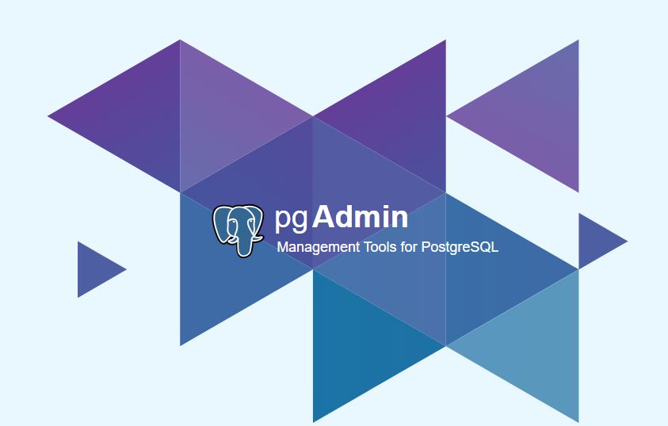

# API REST FULL MARKETPLACE  - SPRING BOOT 3    

 Projeto de uma API RESTFULL  de marketplace a onde o foco foi fazer a relação CRUD, para que a mesma seja consumida.

# INDICE 
<a href="#Tecnologias">Tecnologias usadas </a> 

<a href="#Consumo">Consumo da API </a> 

<a href="#Autor">Quem sou eu</a> 

<a href="#Referencia">Referências externas</a> 

# Consumo

Métodos para o chamado no POST gerando conectividade da atividade com os CRUDs realizado 

Ferramenta utilizada para criação do bd e para controle de acesso via POST do CRUD. 

Tabela criada e suas tuplas. 

# Tecnologias

As tecnologias utilizadas no projeto embarcam o campo de backend e de banco de dados, sendo um projeto de REST foi utilizado como linguagem JAVA JDK 21.0.2, seguido do framework SPRING BOOT em sua versão 3.2 .3, POSTMAN para validação e passagem das urls do crud além do POSTGRES para que fosse criado o banco de dados ligado ao código e a RESTFULL API. Projeto desenvolvido no INTELIJ. 

 </img> </img> 

# Autor
Me chamo Welington, sou estudante de engenharia de software, dentro dos 4 anos de faculdade fui muito reconhecido na área da gestão de equipe e produtos, com tudo meu foco sempre foi ser um bom desenvolvedor back-end, com o passar do tempo fui deixando de lado essa vontade, porém ao final do meu penultimo ano essa chama foi reacendida e agora corro para ser o melhor que posso em backend e assim como na gestão fui refêrencia para muitas pessoas busco ser no back-end também.

Já fui gestor da área de Processos e Négocios da STARTUP DE TI - UNICEPLAC e também gestor da área de projetos e equipes, além de atuar como analista de negócios e atuar como desenvolvedor mobile durante 7 meses para um proejto da startup. 

# Referencia

1. [YOUTUBE](https://youtu.be/wlYvA2b1BWI?si=coVgQgy8VVElbC3b)

2. [JAVA DOCUMENTATION](https://docs.oracle.com/en/java/javase/21/)

3. [SPRING DOCUMENATATION]( https://docs.spring.io/spring-boot/docs/current/reference/htmlsingle/#getting-started.installing)
    
4. [POSTGRES](https://www.postgresql.org/docs/)  

5. [POSTMAN](https://learning.postman.com/docs/introduction/overview/)

